# CreditRiskAnalysis
Credit risk is an inherently unbalanced classification problem, as good loans easily outnumber risky loans. Therefore, you’ll need to employ different techniques to train and evaluate models with unbalanced classes. Jill asks you to use imbalanced-learn and scikit-learn libraries to build and evaluate models using resampling.
We are performing different algorithms to predict credit risk which include:

 - Using resampling models to predict credit risk.
 - Using the SMOTEENN algorithm to protect the credit risk.
 - using the Ensamble classifier to predict credit risk.

## Files and software used
- Jupyter Notebook
- 2019 loan status csv datafile
- imbalanced-learn and scikik-learn libraries.

## Analysis

The first step to perform any resampling or any analysis is to load the data into data frames and perform the exploration part to check for any null values and outliers. The next step is to drop all the null values and change the column names.

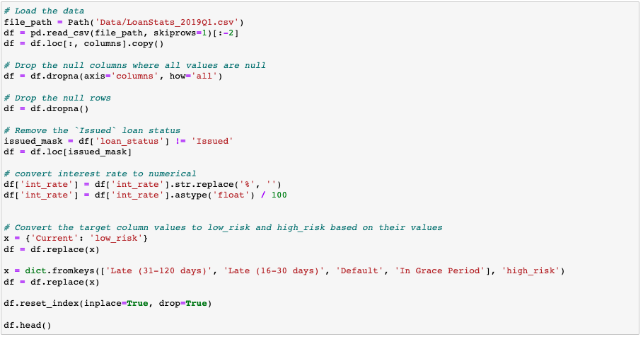

Now our data looks something like this.

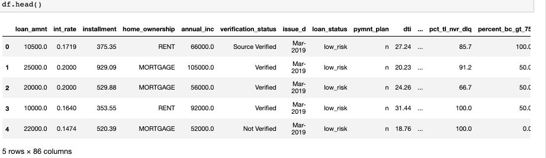

In order to create any model, we have to convert all the string values into integer values. For that, we will create a list of all the columns which are off object data type and then convert them into integer values using pandas get_dummies. We also create our features and targets.

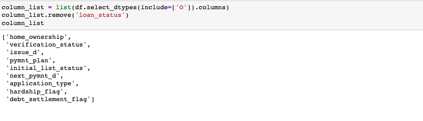

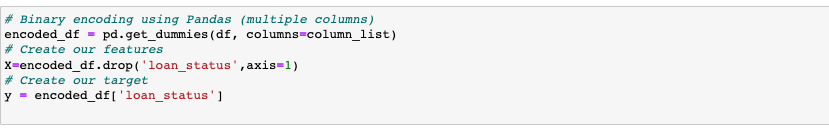

Once our data is ready to be trained and tested using the data model, we split our data into train and test which will help in learning and evaluating the accuracy of our data model.

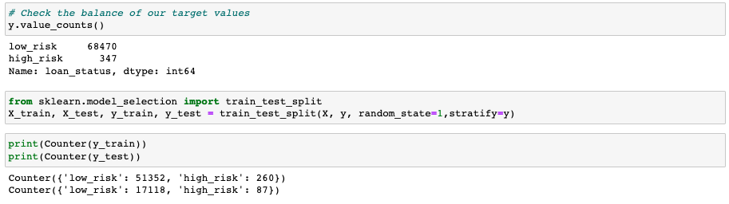

By looking at the count above, we have to perform different oversampling and under-sampling techniques to make our data, even so and eliminate the chance of having a biased model.

### OverSampling

In this section, we will compare two oversampling algorithms to determine which algorithm results in the best performance. You will oversample the data using the naive random oversampling algorithm and the SMOTE algorithm. For each algorithm, be sure to complete the following steps:

- View the count of the target classes using Counter from the collections library.
- Use the resampled data to train a logistic regression model.
- Calculate the balanced accuracy score from sklearn.metrics.
- Print the confusion matrix from sklearn.metrics.
- Generate a classification report using the imbalanced_classification_report from imbalanced-learn.

#### Naive OverSampling

Our first approach is to perform oversampling using RandomOverSampler.

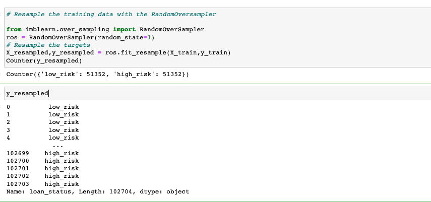

Just, we will train our Logistic Regression model using the resample data and calculate the predictions and accuracy of the model.

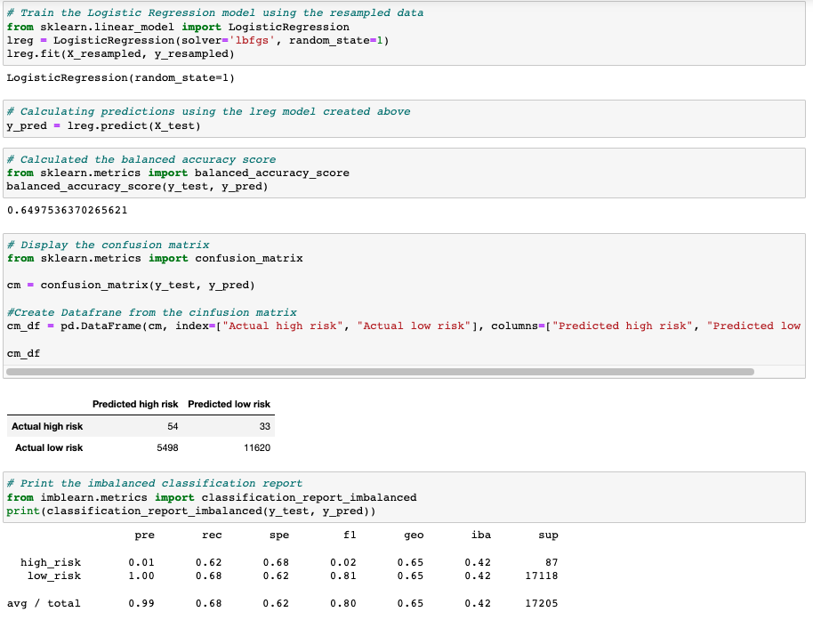

#### SMOTE OverSampling

We will perform the same steps above using the SMOTE oversampling technique and then use resampled data to train our logistic regression model and compare the accuracy.

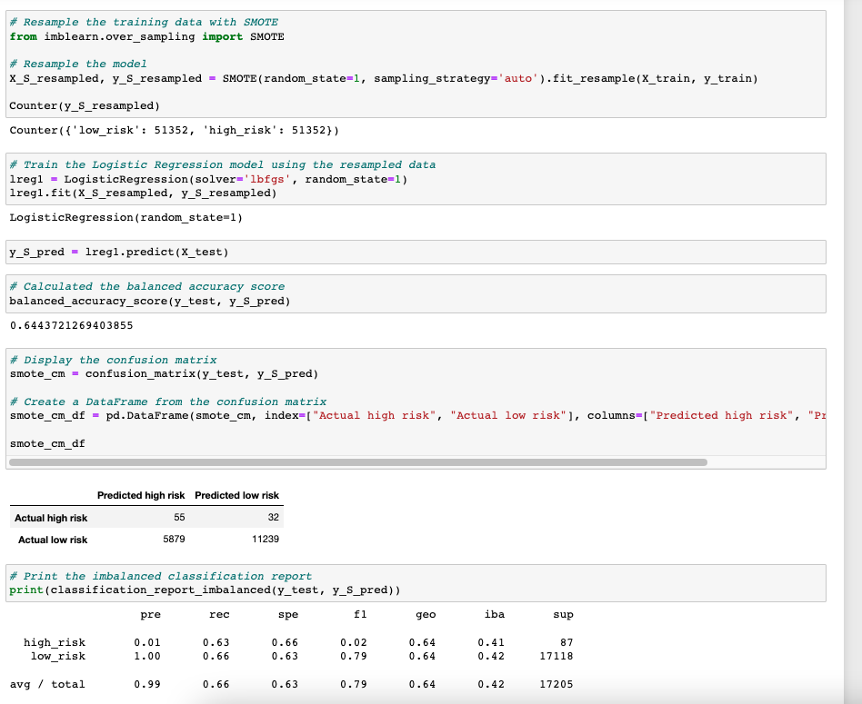

### UnderSampling

In this section, we will test undersampling algorithms to determine which algorithm results in the best performance compared to the oversampling algorithms above. You will undersample the data using the Cluster Centroids algorithm and complete the following steps:

- View the count of the target classes using Counter from the collections library.
- Use the resampled data to train a logistic regression model.
- Calculate the balanced accuracy score from sklearn.metrics.
- Print the confusion matrix from sklearn.metrics.
- Generate a classification report using the imbalanced_classification_report from imbalanced-learn.

#### ClusterCentrid undersampling.

This approach applies the same steps to create balanced data for our model. In this under-sampling technique, we use cluster centroid to under-sample data and then use that under-sampled data to train our regression model and check its accuracy. Notice the number of high-risk and low risk is about 260, which was about over 50,000 in the over-sampling approach.

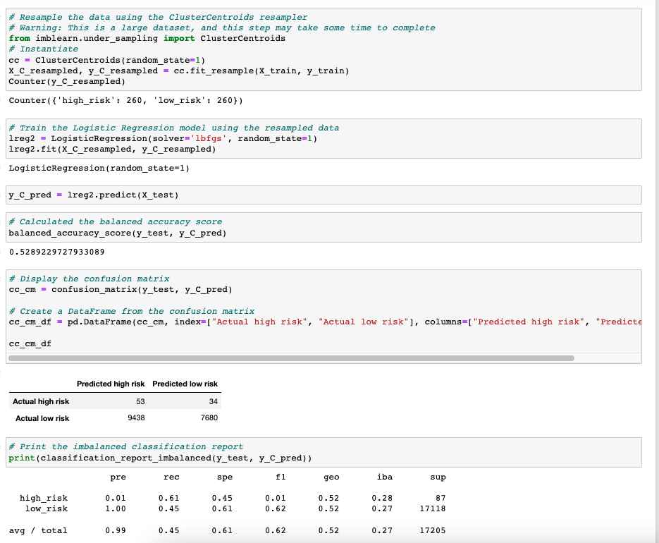

### Oversampling and Undersampling combined

In this section, we will test a combination of over-sampling and under-sampling algorithms to determine if the algorithm results in the best performance compared to the other sampling algorithms above. You will resample the data using the SMOTEENN algorithm and complete the following steps:

- View the count of the target classes using Counter from the collections library.
- Use the resampled data to train a logistic regression model.
- Calculate the balanced accuracy score from sklearn.metrics.
- Print the confusion matrix from sklearn.metrics.
- Generate a classication report using the imbalanced_classification_report from imbalanced-learn.

#### SMOTEENN

There is another approach in which we perform under-sampling and over-sampling of data at the same time using SMOTE and ENN algorithms combined which is called SMOTEENN.

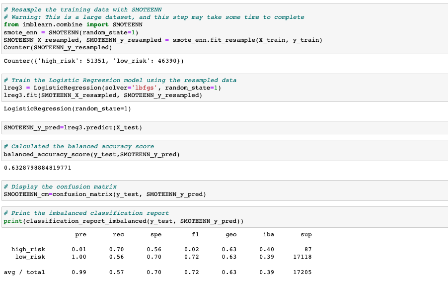

If you notice in this approach the total number of high-risk and low-risk are not the exact numbers, they are balanced but not equal.

### Ensemble Learners

In this section, we will compare two ensemble algorithms to determine which algorithm results in the best performance. You will train a Balanced Random Forest Classifier and an Easy Ensemble AdaBoost classifier. For each algorithm, be sure to complete the following steps:

- Train the model using the training data.
- Calculate the balanced accuracy score from sklearn.metrics.
- Print the confusion matrix from sklearn.metrics.
- Generate a classification report using the imbalanced_classification_report from imbalanced-learn.
- For the Balanced Random Forest Classifier only, print the feature importance sorted in descending order (a most important feature to least important) along with the feature score

#### Balanced Random Forest Classifier

A balanced random forest classifier is the extension of the bagging technique that fits multiple models on different subsets of the training dataset and then combines the prediction from all the models.

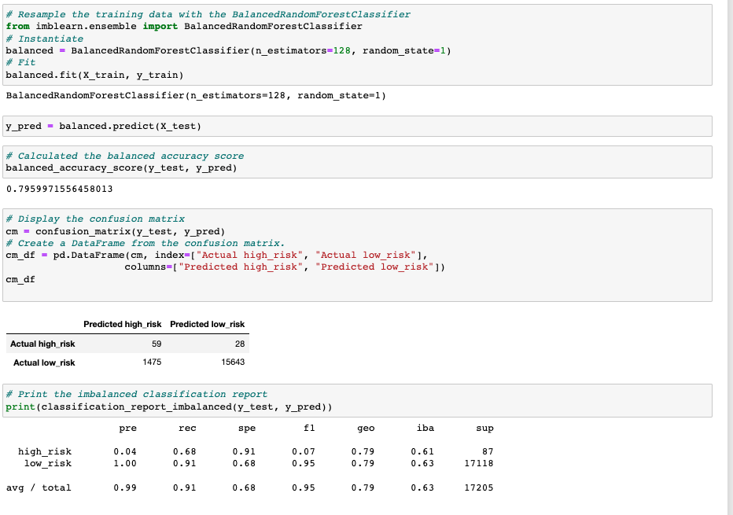

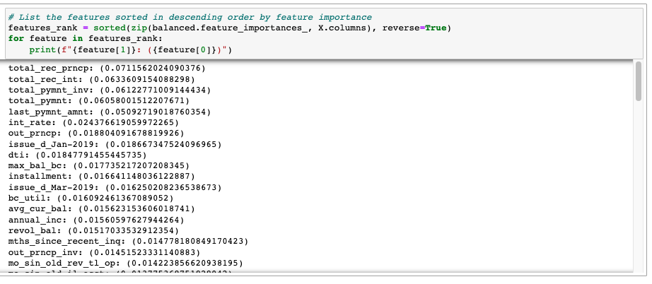

#### Easy Ensemble AdaBoost Classifier

Easy Ensemble Adaboost classifier combines multiple classifiers to increase the accuracy of the classifiers. Adaboost is an iterative ensemble model. This builds a strong classifier by combining multiple poorly performing classifiers so that you get high accuracy strong classifier.

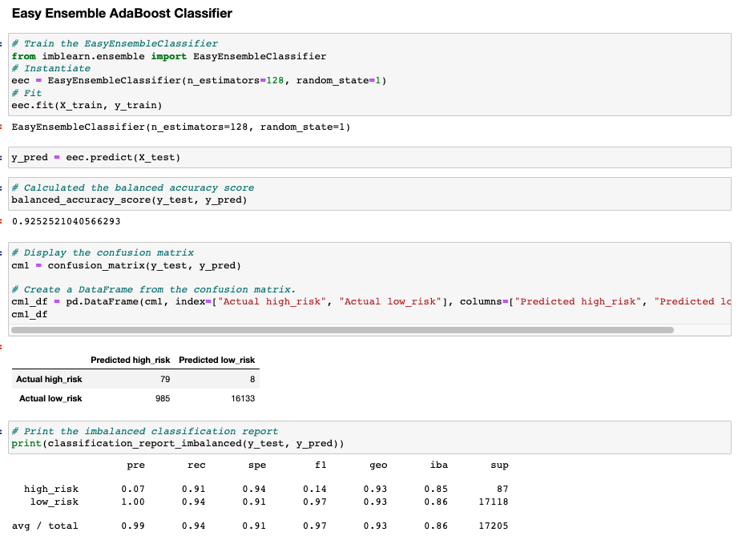

### Summary

We practised different approaches of over-sampling and under-sampling and oversampling algorithms to create balanced data for our model. Different approaches work better on different data sets depending on the number of classifiers and imbalance in the dataset.

For our credit risk analysis purpose, the easy ensemble AdaBoost classifier works best as it has the highest accuracy as compared to other algorithms.

